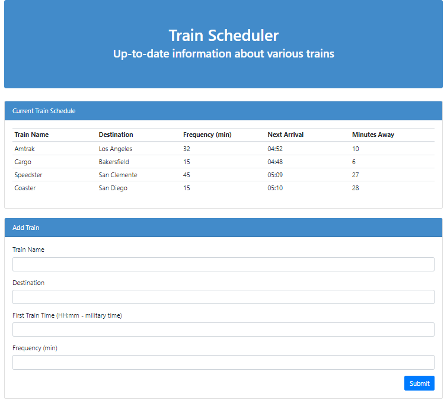

# Train-Scheduler
Train schedule application that incorporates Firebase to host arrival and departure data. This website provides up-to-date information about various trains, namely their arrival times and how many minutes remain until they arrive at their station.

This app calculates when the next train will arrive relative to the current time by using Moment.js.

Front-End web app showing train schedule using HTML5, CSS3, Javascript, JQuery.

Link to GitHub pages: https://boki23m.github.io/Train-Scheduler/

